# 📊 QA Metrics Dashboard - Boost.org

> **Automated Quality Gate Report**

**Last Updated:** Tuesday, December 23, 2025 at 11:23 AM | **Env:** STAGING | **Branch:** main
**Run:** [#138](https://github.com/karimarie67/QA-documentation/actions/runs/20465959566)

---

## 🎯 Executive Summary

| Metric | Current Value | Status |
|--------|---------------|----------------|
| **Pass Rate** | **100.0%** | 🟢 Excellent |
| **Duration** | **20.1s** | ✅ Good |
| **Total Tests** | 6 | 6 Pass / 0 Fail |
| **Functional** | 0 Tests | ❌ Missing |

---

### 📉 Trend Visualization

```mermaid
graph LR
    title[Pass Rate Trend - Last 15 Runs]
    style title fill:#fff,stroke:#fff
    0[#122]:::bar
    0 -- 100% --> 1
    1[#123]:::bar
    1 -- 100% --> 2
    2[#124]:::bar
    2 -- 100% --> 3
    3[#125]:::bar
    3 -- 100% --> 4
    4[#126]:::bar
    4 -- 100% --> 5
    5[#127]:::bar
    5 -- 100% --> 6
    6[#128]:::bar
    6 -- 100% --> 7
    7[#129]:::bar
    7 -- 100% --> 8
    8[#130]:::bar
    8 -- 100% --> 9
    9[#131]:::bar
    9 -- 100% --> 10
    10[#133]:::bar
    10 -- 100% --> 11
    11[#134]:::bar
    11 -- 100% --> 12
    12[#135]:::bar
    12 -- 100% --> 13
    13[#136]:::bar
    13 -- 100% --> 14
    14[#138]:::bar
    classDef bar fill:#e1f5fe,stroke:#01579b,stroke-width:2px;
```

---

### 🌐 Browser Breakdown

| Project | Pass Rate | Status |
|---|---|---|
| **staging** | 100.0% | 🟢 |

---

## 🔍 Detailed Test Results

### 🔥 Smoke Tests
| Test Name | Status | Duration | Project |
|-----------|--------|----------|---------|
| Homepage loads with key elements | ✅ passed | 1.6s | staging |
| Navigation menu links work correctly | ✅ passed | 3.2s | staging |
| Libraries page displays and links to documentation | ✅ passed | 8.1s | staging |
| Download section works correctly | ✅ passed | 2.6s | staging |
| Search bar works with basic query | ✅ passed | 3.5s | staging |
| Homepage is responsive on mobile | ✅ passed | 1.2s | staging |

### 🧩 Functional Tests (Errors, Docs, Search)
> *No tests found in this category* 

### 🔄 Regression Tests
> *No tests found in this category* 

### 📦 Version Tests
> *No tests found in this category* 

---

## 📈 History (Last 10 Runs)
| Date | Pass Rate | Duration | Failures |
|------|-----------|----------|----------|
| Dec 23 | 100.0% | 20.1s | 0 |
| Dec 23 | 100.0% | 2m 31s | 0 |
| Dec 23 | 100.0% | 23.0s | 0 |
| Dec 23 | 100.0% | 4m 8s | 0 |
| Dec 23 | 100.0% | 22.7s | 0 |
| Dec 23 | 100.0% | 25.3s | 0 |
| Dec 23 | 100.0% | 22.5s | 0 |
| Dec 22 | 100.0% | 21.5s | 0 |
| Dec 22 | 100.0% | 20.8s | 0 |
| Dec 22 | 100.0% | 22.2s | 0 |

---
