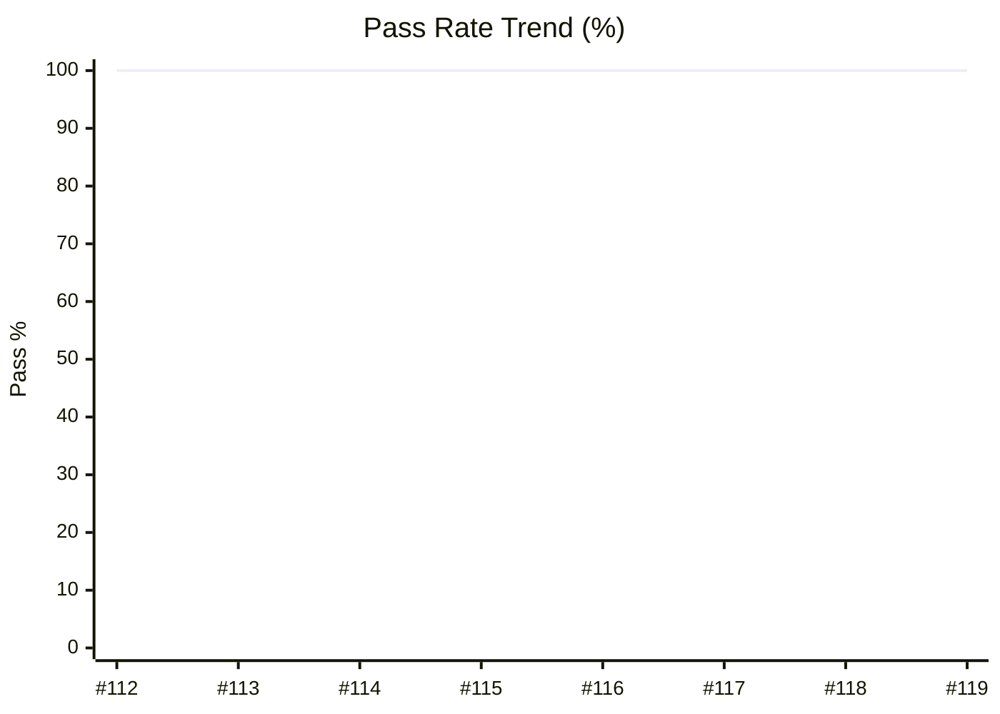

# 📊 QA Metrics Dashboard - Boost.org

> **Automated Quality Gate Report**

**Last Updated:** Tuesday, December 9, 2025 at 4:37 PM | **Env:** STAGING | **Branch:** main
**Run:** [#119](https://github.com/karimarie67/QA-documentation/actions/runs/20078541206)

---

## 🎯 Executive Summary

| Metric | Current Value | Trend / Status |
|--------|---------------|----------------|
| **Pass Rate** | **100.0%** | 🟢 **Excellent** |
| **Execution Time** | **10m 15s (🔴 595.3s 🔺 Slower)** | ⚠️ Long Running |
| **Total Tests** | 84 | 84 Passing / 0 Failed |
| **Flakiness** | 0 Recurring Issues | ✅ Stable |

---

## 📋 Test Suite Coverage

| Test Suite | Tests Run | Pass Rate | Target | Status |
|------------|-----------|-----------|--------|--------|
| 🔥 **Smoke Tests** | 6 | 100.0% | 100% | ✅ Passing |
| 🔄 **Regression Tests** | 14 | 100.0% | 95% | ✅ Passing |
| 📦 **Version Tests** | 2 | 100.0% | 98% | ✅ Passing |
| ⚠️ **Error Handling** | 6 | 100.0% | 95% | ✅ Passing |
| 🔍 **Download & Search** | 9 | 100.0% | 95% | ✅ Passing |
| 📚 **Documentation** | 47 | 100.0% | 95% | ✅ Passing |

---

### 📉 Reliability Trend (Last 20 Runs)

---

### 🌐 Browser / Project Compatibility

| Project | Pass Rate | Status |
|---|---|---|
| **staging** | 100.0% | 🟢 |

---

## ⚠️ Top Flaky / Recurring Failures
> *No recurring failures detected in the last 10 runs. Great job!* 🎉

---

## 🔍 Detailed Test Results

### 🔥 Smoke Tests (Target: 100%)
| Test Name | Status | Duration | Project |
|-----------|--------|----------|---------|
| Homepage loads with key elements | ✅ passed | 1.9s | staging |
| Navigation menu links work correctly | ✅ passed | 4.4s | staging |
| Libraries page displays and links to documentation | ✅ passed | 7.7s | staging |
| Download section works correctly | ✅ passed | 2.8s | staging |
| Search bar works with basic query | ✅ passed | 3.6s | staging |
| Homepage is responsive on mobile | ✅ passed | 1.4s | staging |

### 🔄 Regression Tests (Target: 95%)
| Test Name | Status | Duration | Project |
|-----------|--------|----------|---------|
| Homepage loads and displays key elements | ✅ passed | 4.2s | staging |
| Search bar is visible and functional | ✅ passed | 3.9s | staging |
| Navigation menu links work | ✅ passed | 27.9s | staging |
| Responsive design adapts to mobile viewport | ✅ passed | 1.6s | staging |
| Logo redirects to homepage | ✅ passed | 4.6s | staging |
| Footer links are accessible | ✅ passed | 1.8s | staging |
| Main content loads on library page | ✅ passed | 4.0s | staging |
| External links are valid | ✅ passed | 1.9s | staging |
| GitHub links point to correct repositories | ✅ passed | <1s | staging |
| Documentation page loads and displays content | ✅ passed | 4.1s | staging |

*... and 4 more tests*

### 📦 Version Tests (Target: 98%)
| Test Name | Status | Duration | Project |
|-----------|--------|----------|---------|
| Libraries page loads and displays version information | ✅ passed | 6.0s | staging |
| Releases page loads and displays release information | ✅ passed | 2.6s | staging |

### ⚠️ Error Handling Tests (Target: 95%)
| Test Name | Status | Duration | Project |
|-----------|--------|----------|---------|
| 404 page displays appropriate error message | ✅ passed | 1.5s | staging |
| Broken documentation link returns appropriate error | ✅ passed | 1.1s | staging |
| Invalid search query handles gracefully | ✅ passed | 1.5s | staging |
| Malformed URL redirects or shows error appropriately | ✅ passed | 4.8s | staging |
| Broken external links are identified | ✅ passed | 2.4s | staging |
| Form validation errors display correctly | ✅ passed | 1.3s | staging |

### 🔍 Download & Search Tests (Target: 95%)
| Test Name | Status | Duration | Project |
|-----------|--------|----------|---------|
| Download links return valid HTTP status codes | ✅ passed | 3.0s | staging |
| Download file names are correct format | ✅ passed | 2.2s | staging |
| Version selector displays available versions | ✅ passed | 2.3s | staging |
| Download page displays file sizes | ✅ passed | 2.7s | staging |
| Search returns relevant results for common queries | ✅ passed | 12.9s | staging |
| Search with special characters handles gracefully | ✅ passed | 12.0s | staging |
| Empty search shows appropriate message | ✅ passed | 1.5s | staging |
| Search result pagination works correctly | ✅ passed | 5.7s | staging |
| Search autocomplete/suggestions appear | ✅ passed | 1.4s | staging |

### 📚 Documentation Tests (Target: 95%)
| Test Name | Status | Duration | Project |
|-----------|--------|----------|---------|
| Homepage loads and displays key elements | ✅ passed | 8.8s | staging |
| Search bar is visible and functional | ✅ passed | 7.3s | staging |
| Navigation menu links work | ✅ passed | 30.9s | staging |
| Responsive design adapts to mobile viewport | ✅ passed | 3.2s | staging |
| Logo redirects to homepage | ✅ passed | 7.5s | staging |
| Footer links are accessible | ✅ passed | 3.7s | staging |
| Main content loads on library page | ✅ passed | 6.7s | staging |
| External links are valid | ✅ passed | 3.8s | staging |
| GitHub links point to correct repositories | ✅ passed | 2.3s | staging |
| Documentation page loads and displays content | ✅ passed | 5.6s | staging |

*... and 37 more tests*

---

## 📈 History (Last 10 Runs)
| Date | Pass Rate | Duration | Failures | Status |
|------|-----------|----------|----------|--------|
| Dec 9 | 100.0% | 10m 15s | 0 | 🟢 |
| Dec 9 | 100.0% | 20.0s | 0 | 🟢 |
| Dec 9 | 100.0% | 28.7s | 0 | 🟢 |
| Dec 9 | 100.0% | 2m 29s | 0 | 🟢 |
| Dec 9 | 100.0% | 21.7s | 0 | 🟢 |
| Dec 9 | 100.0% | 2m 30s | 0 | 🟢 |
| Dec 9 | 100.0% | 19.4s | 0 | 🟢 |
| Dec 9 | 100.0% | 0s | 0 | 🟢 |

---
