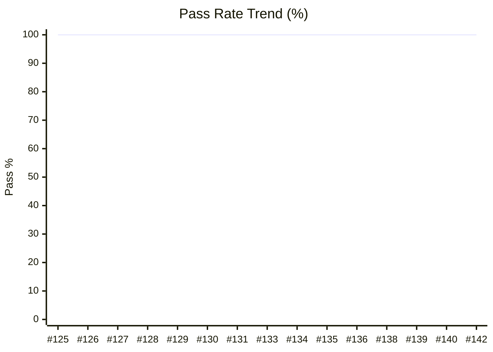

# 📊 QA Metrics Dashboard - Boost.org

> **Automated Quality Gate Report**

**Last Updated:** Tuesday, December 23, 2025 at 12:48 PM | **Env:** STAGING | **Branch:** main
**Run:** [#142](https://github.com/karimarie67/QA-documentation/actions/runs/20467683760)

---

## 🎯 Executive Summary

| Metric | Current Value | Status |
|--------|---------------|----------------|
| **Pass Rate** | **100.0%** | 🟢 Excellent |
| **Duration** | **4m 7s** | ✅ Good |
| **Total Tests** | 47 | 47 Pass / 0 Fail |
| **Functional** | 25 Tests | ✅ Active |

---

### 📉 Trend Visualization

---

### 🌐 Browser Breakdown

| Project | Pass Rate | Status |
|---|---|---|
| **staging** | 100.0% | 🟢 |

---

## 🔍 Detailed Test Results

### 🔥 Smoke Tests
| Test Name | Status | Duration | Project |
|-----------|--------|----------|---------|
| Homepage loads with key elements | ✅ passed | 1.6s | staging |
| Navigation menu links work correctly | ✅ passed | 3.9s | staging |
| Libraries page displays and links to documentation | ✅ passed | 7.6s | staging |
| Download section works correctly | ✅ passed | 3.9s | staging |
| Search bar works with basic query | ✅ passed | 3.5s | staging |
| Homepage is responsive on mobile | ✅ passed | 1.2s | staging |

### 🧩 Functional Tests (Errors, Docs, Search)
| Test Name | Status | Duration | Project |
|-----------|--------|----------|---------|
| 404 page displays appropriate error message | ✅ passed | 1.5s | staging |
| Broken documentation link returns appropriate error | ✅ passed | 1.4s | staging |
| Invalid search query handles gracefully | ✅ passed | 1.4s | staging |
| Malformed URL redirects or shows error appropriately | ✅ passed | 5.2s | staging |
| Broken external links are identified | ✅ passed | 3.3s | staging |
| Form validation errors display correctly | ✅ passed | 1.4s | staging |
| Download links return valid HTTP status codes | ✅ passed | 3.3s | staging |
| Download file names are correct format | ✅ passed | 2.6s | staging |
| Version selector displays available versions | ✅ passed | 2.9s | staging |
| Download page displays file sizes | ✅ passed | 2.5s | staging |

*... and 15 more tests*

### 🔄 Regression Tests
| Test Name | Status | Duration | Project |
|-----------|--------|----------|---------|
| Homepage loads and displays key elements | ✅ passed | 4.5s | staging |
| Search bar is visible and functional | ✅ passed | 3.7s | staging |
| Navigation menu links work | ✅ passed | 27.8s | staging |
| Responsive design adapts to mobile viewport | ✅ passed | 1.5s | staging |
| Logo redirects to homepage | ✅ passed | 4.4s | staging |
| Footer links are accessible | ✅ passed | 1.6s | staging |
| Main content loads on library page | ✅ passed | 3.4s | staging |
| External links are valid | ✅ passed | 1.8s | staging |
| GitHub links point to correct repositories | ✅ passed | <1s | staging |
| Documentation page loads and displays content | ✅ passed | 3.6s | staging |

*... and 4 more tests*

### 📦 Version Tests
| Test Name | Status | Duration | Project |
|-----------|--------|----------|---------|
| Libraries page loads and displays version information | ✅ passed | 5.5s | staging |
| Releases page loads and displays release information | ✅ passed | 2.6s | staging |

---

## 📈 History (Last 10 Runs)
| Date | Pass Rate | Duration | Failures |
|------|-----------|----------|----------|
| Dec 23 | 100.0% | 4m 7s | 0 |
| Dec 23 | 100.0% | 23.6s | 0 |
| Dec 23 | 100.0% | 4m 14s | 0 |
| Dec 23 | 100.0% | 20.1s | 0 |
| Dec 23 | 100.0% | 2m 31s | 0 |
| Dec 23 | 100.0% | 23.0s | 0 |
| Dec 23 | 100.0% | 4m 8s | 0 |
| Dec 23 | 100.0% | 22.7s | 0 |
| Dec 23 | 100.0% | 25.3s | 0 |
| Dec 23 | 100.0% | 22.5s | 0 |

---
