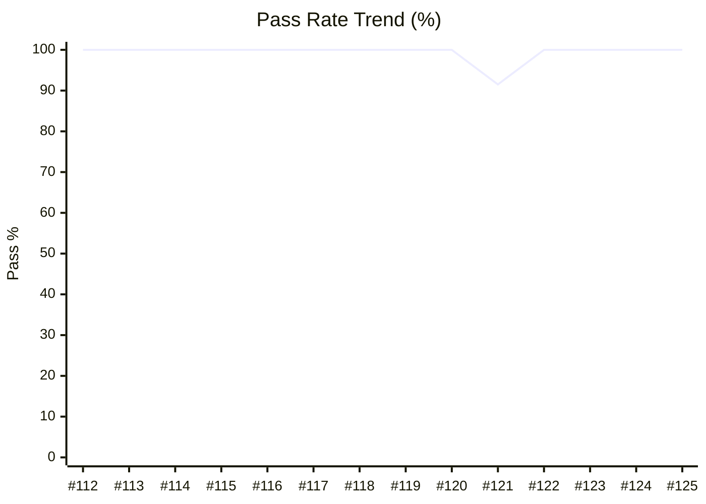

# 📊 QA Metrics Dashboard - Boost.org

> **Automated Quality Gate Report**

**Last Updated:** Monday, December 22, 2025 at 10:10 AM | **Env:** STAGING | **Branch:** main
**Run:** [#125](https://github.com/karimarie67/QA-documentation/actions/runs/20435808239)

---

## 🎯 Executive Summary

| Metric | Current Value | Trend / Status |
|--------|---------------|----------------|
| **Pass Rate** | **100.0%** | 🟢 **Excellent** |
| **Execution Time** | **21.3s (🟢 0.4s 🔺 Slower)** | ✅ Optimized |
| **Total Tests** | 6 | 6 Passing / 0 Failed |
| **Flakiness** | 0 Recurring Issues | ✅ Stable |

---

## 📋 Test Suite Coverage

| Test Suite | Tests Run | Pass Rate | Target | Status |
|------------|-----------|-----------|--------|--------|
| 🔥 **Smoke Tests** | 6 | 100.0% | 100% | ✅ Passing |
| 🔄 **Regression Tests** | 0 | 0% | 95% | ❌ Failing |
| 📦 **Version Tests** | 0 | 0% | 98% | ❌ Failing |
| ⚠️ **Error Handling** | 0 | 0% | 95% | ❌ Failing |
| 🔍 **Download & Search** | 0 | 0% | 95% | ❌ Failing |
| 📚 **Documentation** | 0 | 0% | 95% | ❌ Failing |

---

### 📉 Reliability Trend (Last 20 Runs)

---

### 🌐 Browser / Project Compatibility

| Project | Pass Rate | Status |
|---|---|---|
| **staging** | 100.0% | 🟢 |

---

## ⚠️ Top Flaky / Recurring Failures
> *No recurring failures detected in the last 10 runs. Great job!* 🎉

---

## 🔍 Detailed Test Results

### 🔥 Smoke Tests (Target: 100%)
| Test Name | Status | Duration | Project |
|-----------|--------|----------|---------|
| Homepage loads with key elements | ✅ passed | 2.0s | staging |
| Navigation menu links work correctly | ✅ passed | 4.0s | staging |
| Libraries page displays and links to documentation | ✅ passed | 7.4s | staging |
| Download section works correctly | ✅ passed | 3.3s | staging |
| Search bar works with basic query | ✅ passed | 3.4s | staging |
| Homepage is responsive on mobile | ✅ passed | 1.2s | staging |

### 🔄 Regression Tests (Target: 95%)
*No tests in this category*

### 📦 Version Tests (Target: 98%)
*No tests in this category*

### ⚠️ Error Handling Tests (Target: 95%)
*No tests in this category*

### 🔍 Download & Search Tests (Target: 95%)
*No tests in this category*

### 📚 Documentation Tests (Target: 95%)
*No tests in this category*

---

## 📈 History (Last 10 Runs)
| Date | Pass Rate | Duration | Failures | Status |
|------|-----------|----------|----------|--------|
| Dec 22 | 100.0% | 21.3s | 0 | 🟢 |
| Dec 22 | 100.0% | 20.9s | 0 | 🟢 |
| Dec 22 | 100.0% | 22.7s | 0 | 🟢 |
| Dec 17 | 100.0% | 7.2s | 0 | 🟢 |
| Dec 17 | 91.5% | 4m 3s | 4 | 🟡 |
| Dec 9 | 100.0% | 4m 33s | 0 | 🟢 |
| Dec 9 | 100.0% | 10m 15s | 0 | 🟢 |
| Dec 9 | 100.0% | 20.0s | 0 | 🟢 |
| Dec 9 | 100.0% | 28.7s | 0 | 🟢 |
| Dec 9 | 100.0% | 2m 29s | 0 | 🟢 |

---
